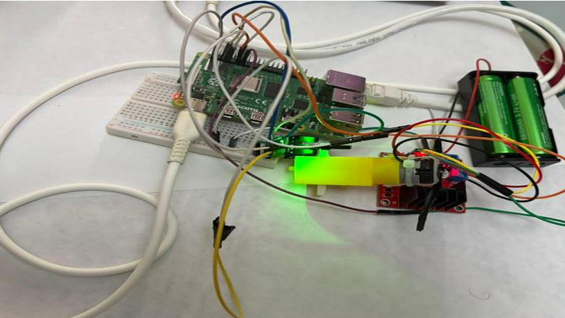
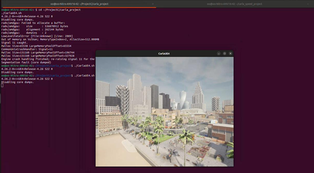
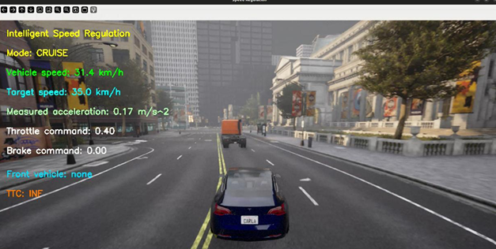
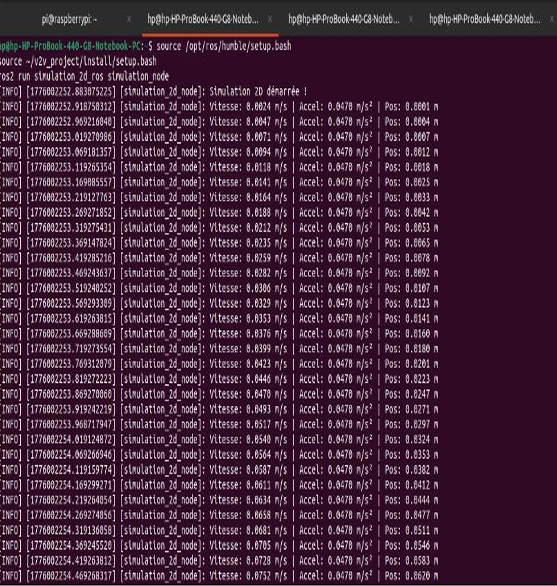
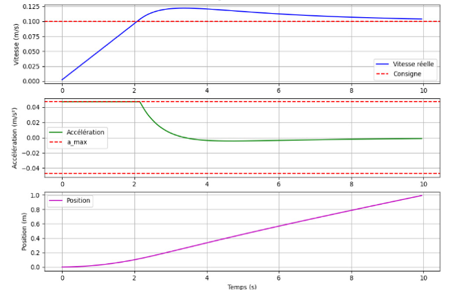
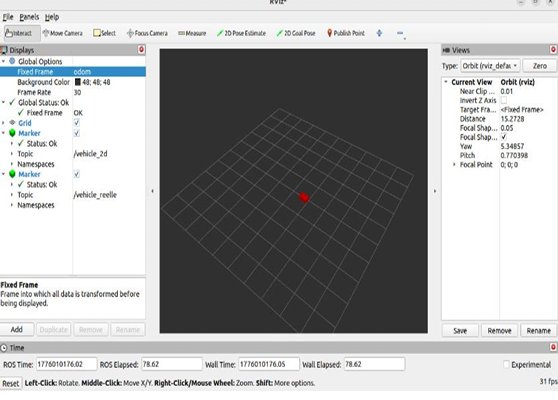
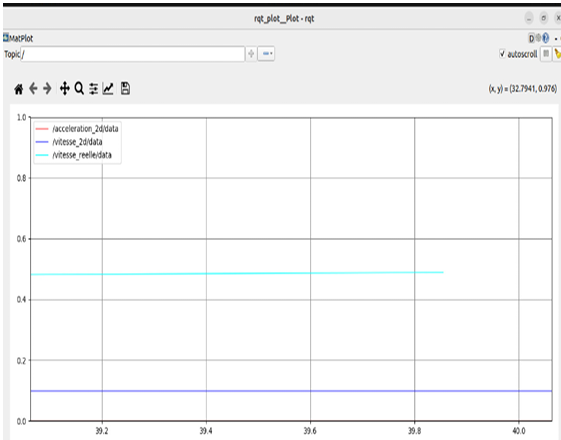

# Intelligent Speed Regulation System using ROS2 and CARLA

## Présentation du Projet

Ce projet présente le développement d’un système intelligent de régulation de vitesse basé sur ROS2 et le simulateur CARLA.

L’objectif principal est de reproduire un comportement réaliste de conduite autonome capable :

- de maintenir une vitesse de consigne,
- d’adapter automatiquement la vitesse selon le trafic,
- de détecter les véhicules situés à l’avant,
- d’estimer le Time To Collision (TTC),
- et d’appliquer automatiquement une commande d’accélération ou de freinage.

Le système combine :

- ROS2 Humble,
- CARLA Simulator,
- Python,
- RViz2,
- rqt_plot,
- et une architecture de communication temps réel.

---

# Environnement Matériel

La plateforme embarquée utilisée dans le projet repose principalement sur :

- Raspberry Pi 4,
- Encodeur IR,
- Driver moteur L298N,
- Moteur DC,
- Batterie externe,
- Communication TCP/IP avec ROS2.

---

# Architecture Générale du Système

L’architecture du système est composée de plusieurs modules :

- Simulateur CARLA,
- Nœud ROS2 principal,
- Régulateur de vitesse,
- Détection du véhicule avant,
- Calcul TTC,
- Visualisation RViz2,
- Monitoring avec rqt_plot.

Le système fonctionne en temps réel avec échange des données entre les différents nœuds ROS2.

---

# Environnement de Simulation CARLA

Le simulateur CARLA permet de générer un environnement urbain réaliste avec trafic dynamique.

La simulation fonctionne en mode synchrone avec un pas de temps fixe :

$$
dt = 0.05\,s
$$

---

# Simulation de Conduite Autonome

Le véhicule autonome évolue dans un environnement urbain réaliste intégrant :

- circulation dynamique,
- véhicules environnants,
- régulation intelligente,
- changement automatique des modes de conduite.

---

# Acquisition des Données

La vitesse du véhicule est calculée à partir des composantes de vitesse :

$$
v = \sqrt{v_x^2 + v_y^2 + v_z^2}
$$

L’accélération est estimée par :

$$
a = \frac{v(k)-v(k-1)}{dt}
$$

Les données surveillées comprennent :

- vitesse du véhicule,
- accélération,
- position,
- distance avec le véhicule avant,
- throttle,
- brake,
- TTC.

---

# Mesure de l’Accélération Maximale

Une phase expérimentale a été réalisée afin de mesurer l’accélération maximale du robot réel.

Les données obtenues ont permis d’ajuster correctement le régulateur PID ainsi que les limites dynamiques du système.

---

# Régulation PID de Vitesse

Le contrôle longitudinal du véhicule est assuré par un régulateur PID.

L’erreur de vitesse est définie par :

$$
e(t)=v_{consigne}-v(t)
$$

La commande appliquée est donnée par :

$$
commande = K_p e + K_i \int e(t)\,dt + K_d \frac{de}{dt}
$$

Les gains PID utilisés permettent :

- une réponse rapide,
- une réduction de l’erreur statique,
- un amortissement des oscillations.

---

# Détection du Véhicule Avant

Le système détecte automatiquement les véhicules situés devant le véhicule principal.

Les critères utilisés sont :

- même voie de circulation,
- distance minimale,
- position avant.

La distance relative est calculée par :

$$
d = \sqrt{dx^2 + dy^2 + dz^2}
$$

---

# Calcul du Time To Collision (TTC)

La vitesse relative est donnée par :

$$
v_{rel}=v_{ego}-v_{front}
$$

Le TTC est calculé par :

$$
TTC = \frac{d}{v_{ego}-v_{front}}
$$

Si :

$$
v_{rel}\leq0
$$

alors :

$$
TTC = \infty
$$

---

# Modes de Fonctionnement

## Mode CRUISE

Lorsque aucun véhicule n’est détecté :

$$
a = 1.2(v_{consigne}-v)
$$

Le véhicule maintient automatiquement sa vitesse cible.

---

## Mode FOLLOW

Lorsqu’un véhicule est détecté à l’avant :

$$
v_{target}=min(v_{consigne},v_{front})
$$

$$
a = 0.9(v_{target}-v)-0.18v_{rel}
$$

Le véhicule adapte automatiquement sa vitesse afin de conserver une distance de sécurité.

---

# Visualisation RViz2

RViz2 permet :

- la visualisation des données temps réel,
- l’affichage du véhicule,
- la supervision des topics ROS2,
- le suivi dynamique du système.

---

# Monitoring avec rqt_plot

L’outil rqt_plot est utilisé afin d’observer :

- la vitesse simulée,
- la vitesse réelle,
- l’accélération,
- les transitions du système.

---

# Résultats Expérimentaux

Les essais réalisés montrent :

- une stabilisation correcte de la vitesse,
- une bonne adaptation au trafic,
- une estimation TTC fonctionnelle,
- une communication ROS2 stable,
- une visualisation temps réel efficace.

Le véhicule est capable de passer automatiquement entre les modes :

- CRUISE,
- FOLLOW,

selon les conditions de circulation.

---

---

# Technologies Utilisées

| Technologie | Utilisation |
|---|---|
| ROS2 Humble | Middleware robotique |
| CARLA Simulator | Simulation de conduite autonome |
| Python 3 | Développement principal |
| NumPy | Calcul scientifique |
| Matplotlib | Visualisation |
| RViz2 | Monitoring ROS2 |
| rqt_plot | Analyse des signaux |

---

# Démonstration

Le projet inclut :

- simulation 2D,
- simulation 3D sous CARLA,
- communication ROS2,
- visualisation RViz2,
- monitoring temps réel,
- régulation intelligente de vitesse.
